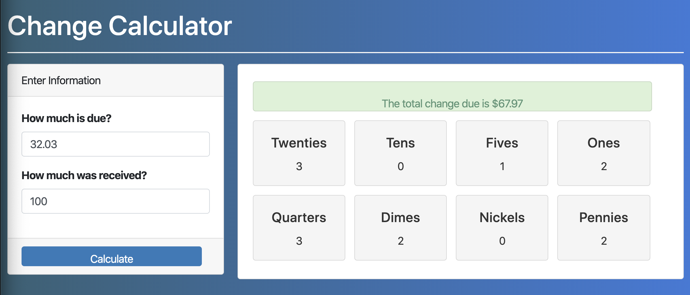

# React100-Change-Calculator



One of my first few React projects in the React100 course at San Diego Code School and the first 
time challenged with making a project look like one given in a sample. Not wanting to use bootstrap or knowing how to implement CSS, I did my best at the time-styling the project with entirely inline attributes.  The project is integrated with two inputs, one for money owed and one for money paid to calculate both 
the total change due and denominations for the payout. 

## Please feel free to demo the project by taking these steps..
```
Clone or fork the repo
```
```
npm install
```
```
npm start
```
```
Open your browser to view on localhost: 3000
```
* **Thank you**, ***-Miles Mickelson***
